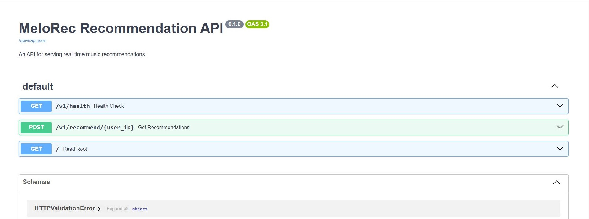

# MeloRec: End-to-End MLOps Music Recommendation Engine

[](https://www.python.org/downloads/release/python-390/)
[](https://fastapi.tiangolo.com/)
[](https://www.docker.com/)
[](https://en.wikipedia.org/wiki/MLOps)

A complete, production-grade MLOps project that builds, trains and deploys a collaborative filtering model to serve real-time song recommendations.



## Core Features

* **ETL Pipeline:** Ingests raw `.txt` data, cleans it with Pandas, and loads it into a relational **PostgreSQL** database.
* **ML Model:** Trains a **Collaborative Filtering (SVD)** model using `scikit-surprise` on user play-count data.
* **Experiment Tracking:** Uses **MLflow** to log all model experiments, parameters, and metrics (like RMSE).
* **Production API:** Serves the model via a high-performance **FastAPI** endpoint, complete with human-readable (Title/Artist) JSON responses.
* **Containerization:** The entire application is containerized with **Docker** and managed with **Docker Compose**.
* **CI/CD Pipeline:** Includes a **GitHub Actions** workflow that automatically tests the code, builds the Docker image and pushes it to a container registry.

##  Project Architecture & Workflow

This project follows a full MLOps lifecycle:

1.  **Data Ingestion:** Raw `.txt` files are processed into clean `.csv` files.
2.  **Database Setup:** A Dockerized PostgreSQL server is launched.
3.  **ETL:** The `ingest_data.py` script creates the database schema and loads the clean CSV data into the `users`, `songs` and `play_history` tables.
4.  **Model Training:** The `train_model.py` script queries the database, trains the SVD model on the play history, and saves the `model.joblib` artifact.
5.  **API Serving:** The `uvicorn` server runs the FastAPI app, which loads the `model.joblib` artifact at startup.
6.  **Recommendation:** A `POST` request to `/v1/recommend/{user_id}` triggers the model, which looks up the top `song_id`s and enriches them with `title` and `artist` data from the database before returning a JSON response.

##  Project Structure

```
MeloRec/
├── .github/
│   └── workflows/
│       └── ci.yml             # CI/CD pipeline for GitHub Actions
├── doc/
│   └── api-docs.png         # Documentation screenshot
├── melorec/                   # The main Python source code package
│   ├── api/                   # FastAPI application
│   │   ├── endpoints.py       # API route logic
│   │   ├── main.py            # FastAPI app declaration
│   │   └── schemas.py         # Pydantic data models
│   │
│   ├── models/                # Model training and prediction logic
│   │   ├── predict.py         # Function to load model and predict
│   │   └── train_model.py     # Script to train the model
│   │
│   ├── processing/            # Data-related logic
│   │   └── feature_engine.py  # SQL queries for feature generation
│   │
│   └── config.py              # Central configuration (DB_URI, etc.)
│
├── scripts/                   # Standalone scripts
│   ├── ingest_data.py         # ETL script to populate the database
│   └── setup_database.sql     # SQL schema definition
│
├── tests/                     # Automated tests
│   ├── test_api.py            # Pytest for API endpoints
│   └── test_model_logic.py    # Pytest for prediction logic
│
├── .dockerignore              # Files to ignore in Docker build
├── .gitignore                 # Files to ignore in Git (data, models, venv)
├── Dockerfile                 # Instructions to build the API image
├── README.md                  # This file
├── docker-compose.yml         # Manages the Postgres database service
└── requirements.txt           # All Python dependencies
```

##  Tech Stack

* **API:** FastAPI, Uvicorn
* **ML/Data:** Pandas, scikit-surprise, MLflow, Joblib
* **Database:** PostgreSQL, SQLAlchemy, Psycopg2
* **DevOps:** Docker, Docker Compose, GitHub Actions
* **Core:** Python 3.9+

##  How to Run Locally

Follow these steps to build and run the entire pipeline on your local machine.

### 1. Prerequisites
* [Docker](https://www.docker.com/products/docker-desktop/) & Docker Compose
* [Python 3.9+](https://www.python.org/downloads/)
* Git

### 2. Clone the Repository
```bash
git clone [https://github.com/Extraordinarytechy/MLOps-Music-Recommender.git](https://github.com/Extraordinarytechy/MLOps-Music-Recommender.git)
cd MeloRec
```

### 3. Data Setup
The raw data is not included in this repository. You must download it and process it.

1.  **Download** the **Million Song Dataset** files (from Kaggle or another source) and place them in a temporary folder. You need:
    * `kaggle_users.txt`
    * `kaggle_visible_evaluation_triplets.txt`
    * `unique_tracks.txt`

2.  **Process the Data:** Run a script similar to the one below (e.g., in a Python environment) to create the clean CSV files.
    ```python
    import pandas as pd
    import os

    # Ensure the output data folder exists
    os.makedirs('data', exist_ok=True)
    
    # 1. Process play history
    play_history = pd.read_csv(
        'path/to/kaggle_visible_evaluation_triplets.txt',
        sep='\t', header=None, names=['user_id', 'song_id', 'play_count']
    )
    play_history.to_csv('data/play_history.csv', index=False)

    # 2. Process songs
    songs = pd.read_csv(
        'path/to/unique_tracks.txt',
        sep='<SEP>', header=None, engine='python',
        names=['track_id', 'song_id', 'artist_name', 'title']
    )
    songs = songs[['song_id', 'title', 'artist_name']]
    songs.to_csv('data/songs.csv', index=False)

    # 3. Process users
    users = pd.read_csv(
        'path/to/kaggle_users.txt',
        sep='\t', header=None, names=['user_id']
    )
    users.to_csv('data/users.csv', index=False)
    
    print("Clean CSV files created in data/ folder!")
    ```
    You should now have `users.csv`, `songs.csv`, and `play_history.csv` inside your `MeloRec/data/` folder.

### 4. Install Dependencies
```bash
pip install -r requirements.txt
```

### 5. Start the Database
This starts a PostgreSQL database in a Docker container.
```bash
docker compose up -d
```

### 6. Ingest Data
This runs the ETL script to load your CSV data into the database.
```bash
python3 scripts/ingest_data.py
```

### 7. Train the Model
This runs the training script, which queries the database, trains the model, and saves `model.joblib`.
```bash
python3 -m melorec.models.train_model
```
*(Optional: Run `mlflow ui` in a new terminal to see the experiment results at `http://127.0.0.1:5000`)*

### 8. Run the API
Your database is full and your model is trained. It's time to start the server!
```bash
uvicorn melorec.api.main:app --reload
```

### 9. Test the API
Your API is now live. Go to **[http://127.0.0.1:8000/docs](http://127.0.0.1:8000/docs)** in your browser to see the interactive documentation and test the endpoint.

---

##  CI/CD Pipeline
This project includes a fully automated CI/CD pipeline in `.github/workflows/ci.yml`. On every `push` to the `main` branch, the pipeline will:
1.  Set up a Python environment.
2.  Install all dependencies.
3.  Run `pytest` to ensure all tests pass.
4.  Log in to the GitHub Container Registry.
5.  Build a new Docker image for the API.
6.  Push the image tagged as `latest`.

##  Future Improvements
* Deploy the service to a Kubernetes cluster (EKS, GKE, AKS).
* Use a managed database (like AWS RDS) instead of a Docker container.
* Integrate MLflow with a remote tracking server and artifact store (like S3).
* Add a nightly GitHub Action to automatically re-train the model.

## Author

* **Ajay kumar**
